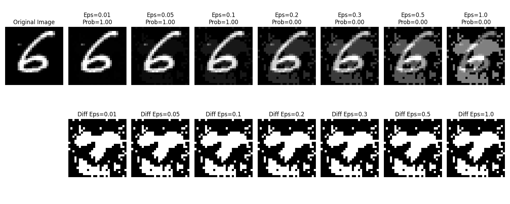
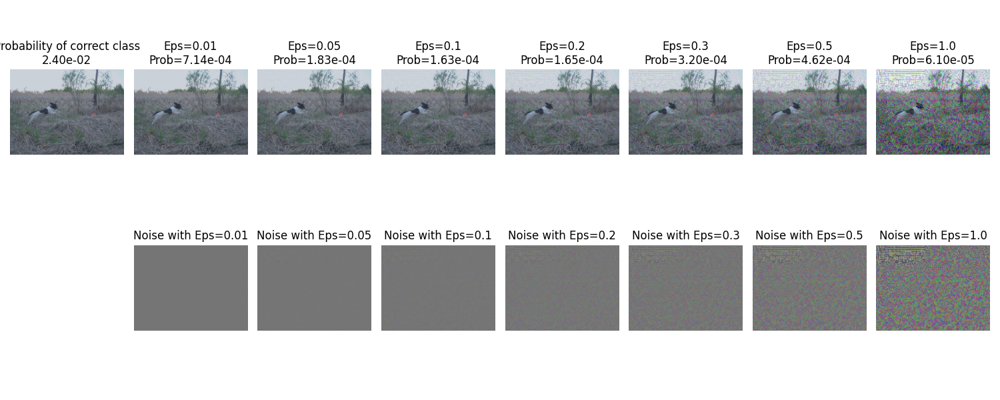

# fgsm


This repo contains code to implement the Fast-Gradient Sign Method (FGSM) to efficiently generate adversarial examples. It was introduced in the following [paper](https://arxiv.org/pdf/1412.6572) by Goodfellow et al in 2015.


The requirements for this code are `torch`, `torchvision`, `matplotlib`, and `numpy`.


The notebook `fgsm.ipynb` contains exploratory code to run FGSM on the MNIST and Imagenette (a smol subset of ImageNet)dataset.


The script `fgsm.py` contains code to run an FGSM attack from the command line. An example command to run the script is shown below.

```
$ python3 fgsm.py --dataset "Imagenette" --epsilon 0.01,0.05,0.1,0.2,0.3,0.5,1.0
```


Provide MNIST to the dataset flag if you want to run an attack on the MNIST dataset instead.


## Samples



